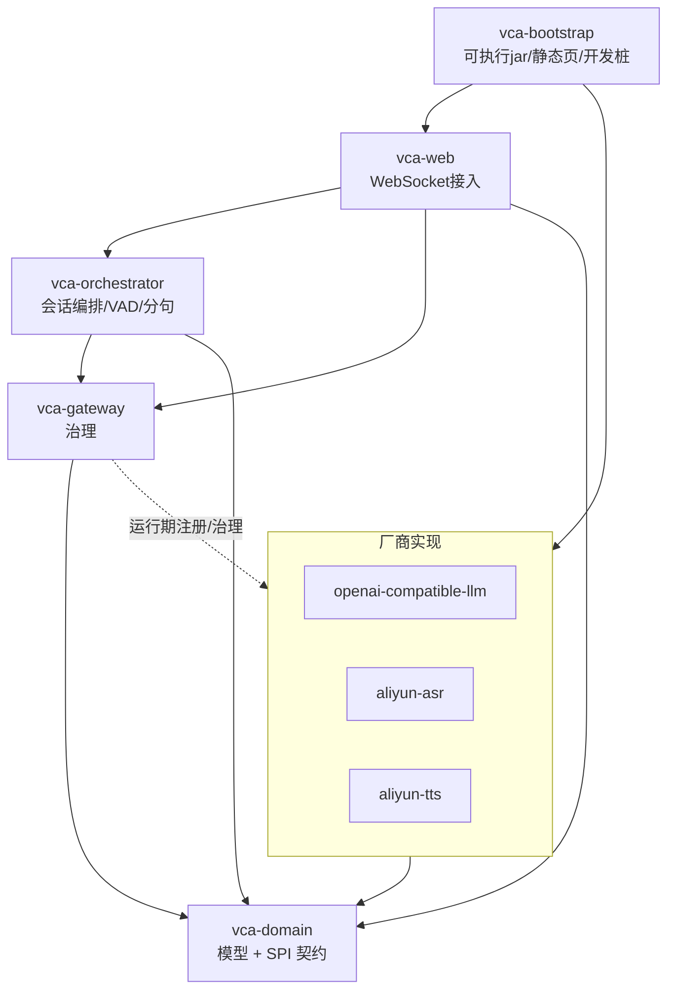
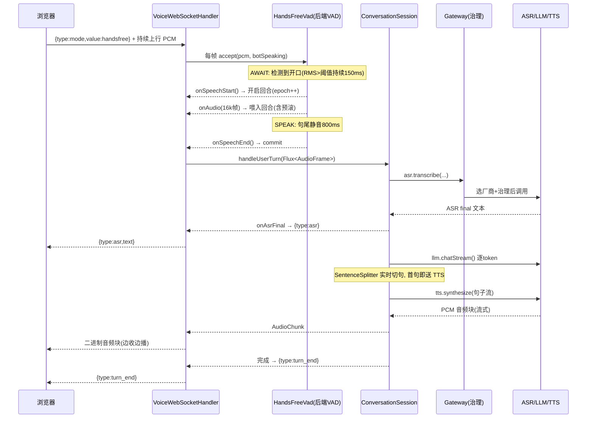

# 01 · 系统架构

## 1. 设计理念

- **模块化单体（Modular Monolith）**：模块是编译期的代码组织单位，最终只有 `vca-bootstrap` 打成一个可执行 jar，部署成**多副本**扛并发。后续可按需把某个模块抽成独立微服务。
- **依赖单向收敛**：所有模块都依赖 `vca-domain`（纯契约，无框架），反向不成立。业务编排不感知具体厂商。
- **全链路响应式（Reactive）**：基于 Spring WebFlux + Project Reactor，ASR/LLM/TTS 全部是 `Flux` 流，边产边消费，**订阅一取消就能释放上游连接**——这正是"打断"能干净生效的基础。
- **瘦客户端**：浏览器只做它必须做的事（采麦、播音、连 WS）；断句、打断、状态机等逻辑全在后端。

## 2. 模块划分

```
vca-domain                 纯契约: 领域模型(record) + SPI 接口 + 枚举, 无 Spring 依赖
├─ vca-gateway             治理层: 选厂商 + 熔断 + 并发配额 + 故障转移
├─ vca-orchestrator        编排核心: 会话/状态机/分句/后端 VAD
├─ vca-provider-llm-openai-compatible  OpenAI 兼容 LLM 实现(DeepSeek/Qwen/Kimi)
├─ vca-provider-asr-aliyun     阿里云 ASR 实现(DashScope paraformer)
├─ vca-provider-tts-aliyun     阿里云 TTS 实现(DashScope CosyVoice)
├─ vca-web                 接入层: WebSocket 处理器 + 会话工厂 + 自动装配
└─ vca-bootstrap           启动模块: 打可执行 jar; 含开发桩 provider + 静态页面
```

### 模块依赖图



> 关键点：`orchestrator` 只依赖 `domain` 的 SPI 接口，拿到的是 `gateway` 包装过的**受治理 provider**，因此自动获得选厂商/熔断/配额/故障转移，而它本身对此无感。

## 3. 整体架构图

```
┌───────────────────────────── 浏览器（瘦客户端 index.html）─────────────────────────────┐
│  AudioContext / getUserMedia(麦克风)  ──采集──►  Int16 PCM 帧                            │
│  Web Audio 播放队列  ◄──播放──  24kHz PCM 音频块                                          │
│  WebSocket 连接 + DOM/按钮                                                               │
└───────────────┬───────────────────────────────────────────────┬───────────────────────┘
        上行: 原始PCM(binary) + 控制(JSON)              下行: TTS音频(binary) + 事件(JSON)
                │                          WebSocket /ws/voice                  ▲
┌───────────────▼───────────────────────────────────────────────┴───────────────────────┐
│ vca-web : VoiceWebSocketHandler（每条连接一个 Connection）                                │
│   · 接收上行 PCM, 按模式(免提/按住说话/文本)分发                                            │
│   · 驱动 HandsFreeVad → 决定 开启回合 / 提交 / 打断                                         │
│   · epoch 门闸: 打断后丢弃旧轮残留音频; 向前端推 state/asr/reply/turn_end/interrupted 事件   │
└───────────────┬─────────────────────────────────────────────────────────────────────────┘
                │ handleUserTurn(Flux<AudioFrame>) / handleTextTurn(text)
┌───────────────▼───────────────────────────────────────────────────────────────────────┐
│ vca-orchestrator : ConversationSession（一路会话）                                        │
│   ASR(取final) ──► 写历史 ──► LLM(流式token) ──► SentenceSplitter(实时分句) ──► TTS(流式)   │
│   状态机: LISTENING→THINKING→SPEAKING→IDLE; 打断→INTERRUPTED                              │
│   打断: takeUntilOther(interrupt) 取消整条流, 释放上游 ASR/LLM/TTS                         │
└───────────────┬─────────────────────────────────────────────────────────────────────────┘
                │ 调用受治理的 SPI provider
┌───────────────▼───────────────────────────────────────────────────────────────────────┐
│ vca-gateway : ProviderGateway → GovernanceExecutor                                       │
│   候选排序 → 跳过熔断打开的候选 → 并发配额 → 调用 → 失败转移到下一候选                        │
└───────────────┬─────────────────────────────────────────────────────────────────────────┘
                │
        ┌───────┴────────┬──────────────────┐
        ▼                ▼                  ▼
   阿里云 ASR        DeepSeek LLM        阿里云 TTS
 (DashScope)     (OpenAI兼容 SSE)      (DashScope)
```

## 4. 一轮对话的数据流（三段式 Pipeline）



**打断（barge-in）时**：用户在机器人说话时开口 → 后端 VAD 检测到持续人声 → `bargeIn()` → `epoch++` + `conversation.bargeIn()` 取消整条流 + 发 `{type:interrupted}` → 前端停播并丢弃在途残留 → 这次插话作为新一轮立刻开始（预滚保证不丢开头）。详见 [技术实现](./02-tech-implementation.md#3-打断barge-in的实现)。

## 5. 会话状态机

```
   IDLE ──(开口/开始)──► LISTENING ──(ASR final)──► THINKING ──(LLM首句)──► SPEAKING
     ▲                       │                          │                      │
     └───────────────────────┴────────(回合结束)─────────┴──────────────────────┘
                                                                                │
        任意 THINKING/SPEAKING 下用户开口(VAD) ──► INTERRUPTED ──► LISTENING/IDLE
```

定义于 `vca-domain` 的 `SessionState`，由 `ConversationStateMachine`（CAS 线程安全，只允许合法迁移）驱动。

## 6. 两种对话模式

| 模式 | 链路 | 说明 |
|------|------|------|
| **三段式 Pipeline**（默认） | ASR → LLM → 分句 → TTS | 各能力独立厂商，最灵活，便于治理与替换 |
| **端到端 S2S** | S2sProvider（音频进、音频出） | 预留接口 `S2sProvider`，由 `SessionContext` 切换；当前 demo 走 Pipeline |

由 `SessionContext.isPipeline()` 决定走哪条；`ConversationSessionFactory` 默认构建 Pipeline 会话。
