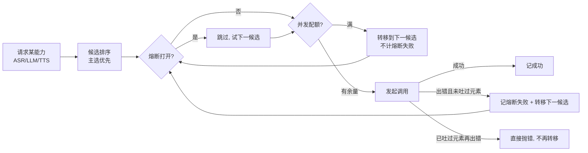

# 02 · 主要技术实现

本文讲清四个核心技术点：**句子级流式流水线**、**后端 VAD 与打断**、**治理层**、**Provider SPI**。

---

## 1. 响应式句子级流水线

> 代码：`vca-orchestrator/.../session/ConversationSession.java`

一轮对话被组织成一条 `Flux` 流，全程不缓冲整段、边产边消费：

```
asr.transcribe(audio)          // 上行音频流 → ASR 事件流(partial... → final)
   .filter(isFinal).next()     // 取本轮最终识别文本
   .flatMapMany(text -> respond(text))

respond(text):
   appendHistory(user)         // 写多轮记忆
   llm.chatStream(history)     // 逐 token 流式
   → SentenceSplitter.split()  // 实时按 。！？等切句, "首句一出就往下走"
   → tts.synthesize(句子流)     // 逐句合成, 流式吐 PCM 音频块
```

**为什么要分句？** LLM 是逐 token 吐字的，如果等整段生成完再合成，首字延迟会很高。`SentenceSplitter` 在 token 流上实时切出第一句（遇到句末标点即吐出），第一句立刻送 TTS 开播，后续句子边生成边补——**首句延迟 ≈ 第一句生成时间 + 第一句合成时间**，而不是整段。

**文本输入走同一条 `respond()`**：`handleTextTurn(text)` 直接把打字内容当作"本轮用户说了什么"注入，**绕过 ASR**，因此无论用真实 ASR 还是开发桩都能进大模型（这修复了 real profile 下文本输入不触发 LLM 的问题）。

**多轮记忆**：`ConversationSession` 维护 `system + user/assistant` 历史（`synchronized` 保护），每轮把快照传给 LLM。

---

## 2. 后端 VAD 与免提状态机

> 代码：`vca-orchestrator/.../vad/`（`VadConfig` / `PcmAudio` / `HandsFreeVad`）

浏览器只负责**持续上传原始 PCM**；是否开口、是否说完、是否打断，全部由后端 `HandsFreeVad` 判定。

### 状态机（对应原前端 await/speak/wait）

```
OFF    关闭(非免提)
AWAIT  聆听·等你开口   —— 持续算 RMS 电平, 不喂 ASR; 检测到持续人声→开口
SPEAK  录音中         —— 把音频喂给 ASR; 句尾静音达阈值→提交本轮
WAIT   等机器人回复    —— 监听打断; 机器人说话时检测到持续人声→打断并立即开启新一轮
```

### 两个关键设计

1. **只有真开口才开启 ASR**：`AWAIT` 状态下不把静音推给云端，避免云端 ASR 因长时间静音判 IdleTimeout。
2. **预滚缓冲（preroll）**：始终保留开口前约 400ms 的音频；一旦判定开口/打断，先把这段预滚补发出去，**不切掉第一个字**，也保证插话被完整识别。

### 阈值（可配置，`vca.web.vad.*`）

| 参数 | 默认 | 含义 |
|------|------|------|
| `speech-threshold` | 0.015 | 语音 RMS 阈值（0~1），超过视为人声 |
| `onset-ms` | 150 | 人声持续多久判定"开口" |
| `silence-ms` | 800 | 句尾静音多久判定"说完"→提交 |
| `barge-threshold` | 0.020 | 打断 RMS 阈值（通常略高于语音阈值）|
| `barge-ms` | 250 | 机器人说话时人声持续多久判定"插话"→打断 |
| `preroll-ms` | 400 | 预滚保留时长 |
| `target-sample-rate` | 16000 | VAD/ASR 统一采样率，上行音频会重采样到此 |

`PcmAudio` 提供纯函数的 PCM 编解码 / RMS 电平 / 重采样（这些原本在浏览器里做，现搬到后端，可单测、可复用）。

---

## 3. 打断（barge-in）的实现

> 代码：`vca-web/.../ws/VoiceWebSocketHandler.java` + `ConversationSession.bargeIn()`

打断要"干净、即时、不残留"，靠**三层**配合：

### 第一层：取消上游流（释放真实连接）

```java
// ConversationSession.handleUserTurn 给回合流挂上:
turn.takeUntilOther(interrupt.asMono())   // interrupt 一发信号, 整条流被取消
```

`bargeIn()` 向 `interrupt` sink 发信号 → `takeUntilOther` 取消订阅 → 上游 ASR/LLM/TTS 的 `Flux` 订阅一并取消。各 Provider 契约要求"订阅取消时释放厂商连接"（DeepSeek 的 WebClient、DashScope 的 Flowable 都会随之断开）。

### 第二层：后端 epoch 门闸（防残留）

真实 TTS 出块常常**快于实时**，且 SDK 取消可能有延迟。为保证打断后**绝不再把旧轮音频发给前端**，每个回合带一个递增的 `epoch`：

```java
private volatile long epoch = 0;

// 开启一轮: long myEpoch = ++epoch; 订阅时用 chunk -> sendChunk(chunk, myEpoch)
// 打断:
private synchronized void bargeIn() {
    epoch++;                 // 先翻代号: 旧轮的块/收尾信号全部失配
    conversation.bargeIn();  // 再取消上游流
    turnSubscription.dispose();
    resetTurn();
    emitJson(interrupted);
}

private void sendChunk(AudioChunk chunk, long chunkEpoch) {
    if (chunkEpoch != epoch) return;   // 不是当前轮的块 → 直接丢弃
    ...
}
```

> `epoch++` 必须在 `conversation.bargeIn()` **之前**：因为取消会**同步**触发旧轮的 `onComplete`，若代号没先翻，会误发 `turn_end`、并在语音打断时误清预滚（丢失插话开头）。`onTurnFinished(turnEpoch, ...)` 也用代号守卫挡掉旧轮的收尾回调。

### 第三层：前端确定性播放门闸（不靠计时）

```js
let acceptAudio = true;
// 收到 interrupted: 立刻停播 + 关闸
'interrupted' → stopPlayback(); acceptAudio = false;
// 下一轮的 asr 到达 = 新一轮音频可以播了 → 开闸
'asr'         → acceptAudio = true;
// 播放函数
playPCM(buf): if (!acceptAudio) return; ...
```

打断后**一直丢弃在途音频，直到下一轮 `asr` 才恢复**——取代了早期"忽略 400ms"的兜底窗口（那个窗口正是"过一会儿又开始说"的根因：残留音频超过 400ms 还在到时会被重新播放）。

### 打断来源

- **语音（免提）**：`HandsFreeVad` 在 `WAIT` 且 `botSpeaking=true` 时检测到持续人声 → `onBargeIn()`。
- **手动按钮 / 主动停止**：前端发 `{type:"barge_in"}` → `manualBarge()`。

---

## 4. 治理层（Gateway）

> 代码：`vca-gateway/.../router/GovernanceExecutor.java`、`ProviderGateway.java`

编排层拿到的不是裸 Provider，而是 `ProviderGateway` 包装的**受治理 Provider**：调用方式完全一样，但自动获得四件事：



- **候选排序**：按会话请求的主厂商优先，其余作为备选（`vca.gateway.<cap>.candidates`）。
- **熔断（CircuitBreaker）**：失败累计到阈值即打开，`open-duration` 内直接跳过该厂商。
- **并发配额（ConcurrencyQuota）**：每厂商 `max-concurrency`；配额满时转移到下一候选，但**不**记为熔断失败（容量问题≠健康问题）。
- **故障转移**：调用出错且**尚未吐出任何元素**时，转移到下一候选重订阅；**已经吐过元素再出错则不转移**（避免重复输出）。

> 注意：对 LLM（输入是静态历史）出错转移安全；对 ASR/TTS（输入是实时热流），只有"订阅前跳过熔断候选"这类转移是安全的，实时输入的重放需上层另行保证。

---

## 5. Provider SPI（厂商可插拔）

> 代码：`vca-domain/.../spi/`

四个能力接口，每个厂商一个实现，运行期由 gateway 收集注册：

| SPI | 输入 → 输出 | 契约要点 |
|-----|------------|---------|
| `AsrProvider` | `Flux<AudioFrame>` → `Flux<AsrEvent>` | 边收边送；先 partial 后 final；收到 `endOfSpeech` 帧尽快出 final；取消即释放连接 |
| `LlmProvider` | `List<Message>` → `Flux<String>` | 逐 token 流式；取消即断开 |
| `TtsProvider` | `Flux<String>` → `Flux<AudioChunk>` | 逐句合成、流式吐 PCM 24kHz/mono/16bit |
| `S2sProvider` | `Flux<AudioFrame>` → `Flux<AudioChunk>` | 端到端语音大模型（预留）|

### 已实现的厂商

- **`vca-provider-asr-aliyun`**：阿里云 DashScope `paraformer-realtime-v2`，RxJava `Flowable` 与 Reactor `Flux` 桥接。
- **`vca-provider-tts-aliyun`**：阿里云 DashScope `cosyvoice-v1`，流式吐 PCM 24kHz。
- **`vca-provider-llm-openai-compatible`**：OpenAI 兼容文本 LLM（DeepSeek/Qwen/Kimi 等），统一走 `/chat/completions` + `stream=true` SSE；含 `ApiKeyPool`（多 key 轮询）、可选代理与厂商级 extra body 配置。

### 开发桩（零外部依赖，`vca-bootstrap/.../dev/`）

- `DevStubAsrProvider`：把上行字节当 UTF-8 文本（配合前端调试）。
- `DevEchoLlmProvider`：回声大脑，逐字流式吐出，便于观察分句/打断。
- `DevStubTtsProvider`：把每句文本原样作为一个"音频块"。

由 `vca.dev.stub-*` 开关分能力启停，便于"真实厂商 + 桩"混搭联调。
